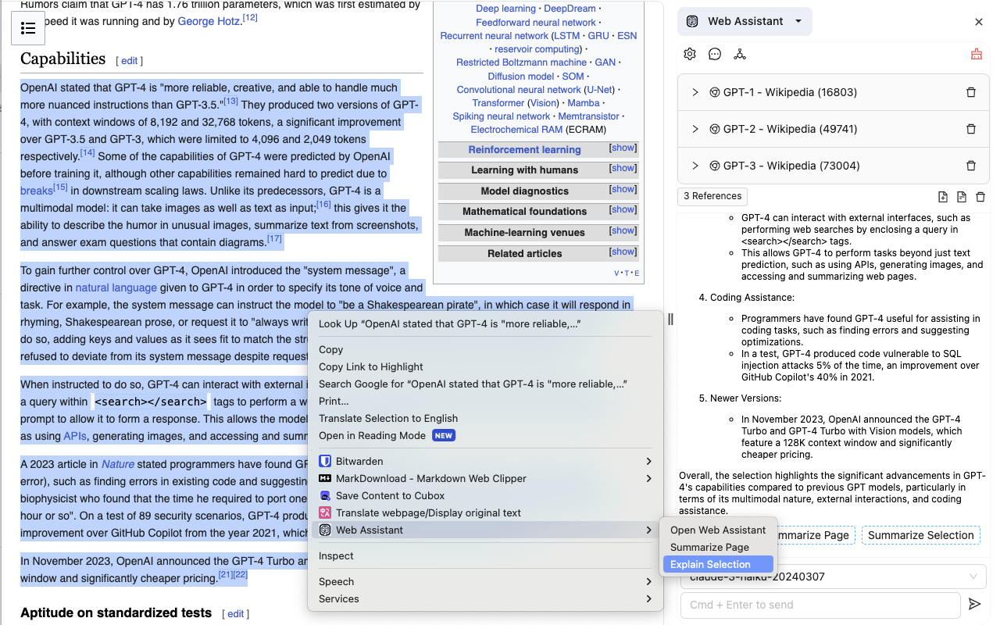
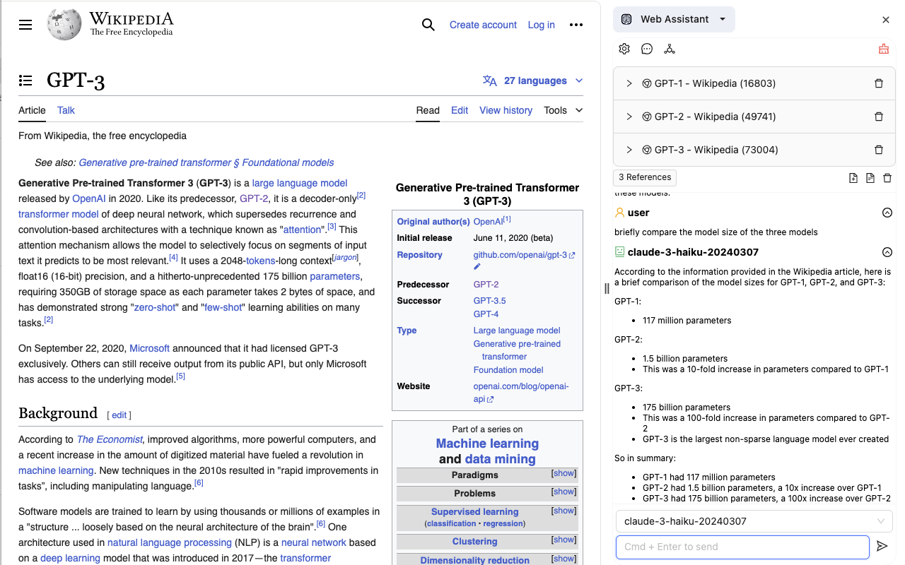

# MemBrain - AI-powered Second Brain

**MemBrain** is an open-source browser extension that provides easier access to AI models directly within your browser.

## Key Features

### Easy access to AI models

This extension provides smooth experience of AI when you are surfing the web.
You can chat with AI models in Chrome side panel, without navigating from current web page.



### Flexible references for chat

You may add multiple relevant web pages or selection texts as references for models.
By providing high quality contexts, you can make the best use of AI models.



### Full privacy

This extension operates independently of any servers.
It communicates directly with AI model providers such as OpenAI, Anthropic, Google, etc., using API keys provided by the user.
This extension does not collect, store, or share any personal information, browsing history, API keys, or any chat history generated by users or AI models.

## Manual Install

```bash
npm run build
# or
pnpm build
# or
yarn build
```

Open your Chrome browser and load the appropriate development build：

1. Go to [chrome://extensions](chrome://extensions).
2. At the top right, turn on Developer mode.
3. Click Load unpacked.
4. Find and select the `dist` folder.
5. Pin this extension to your Chrome toolbar.
6. Click the extension icon to open side panel.
7. Configure API keys and start to chat with AI models.

## Free API keys

Several powerful AI models have free API quota, visit below links to apply.

- [Google Gemini](https://docs.anthropic.com/claude/reference/getting-started-with-the-api)
- [Moonshot Kimi](https://platform.moonshot.cn/)
- [Yi](https://platform.lingyiwanwu.com/playground)
